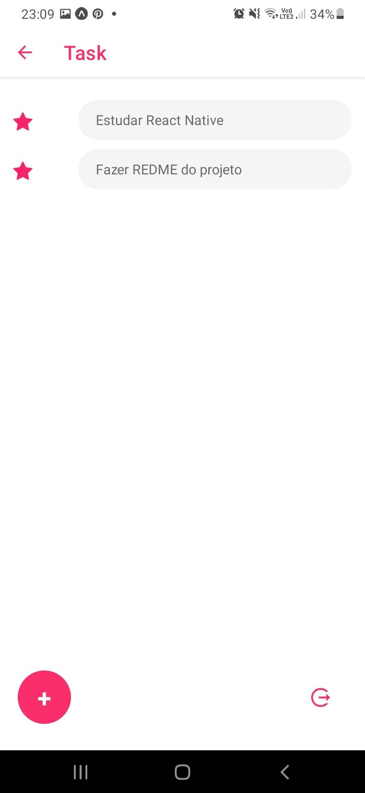

# Projeto Tasks em React Native

Projeto de aplicativo de CRUD de tarefas com React Native e Firebase feito com a ajuda do canal One Bit Code.

## Tecnologias


## Screen Shots

<div align="center">
    
    
    
    
</div>

## Como rodar a aplicação

Esse aplicativo foi desenvolvido com a plataforma Expo. Depois de você instalar o Expo na sua máquina siga os passos seguintes:

```
1. git clone https://github.com/mateusgs29/tasks-react-native.git

2. cd tasks-react-native
```

Depois instale as dependências e inicie o projeto:

```
1. npm install
2. npm start
```